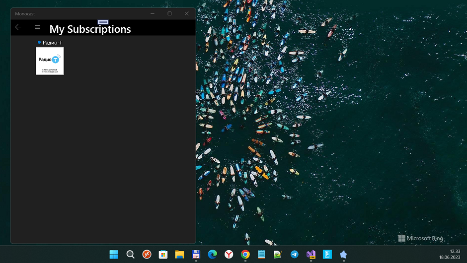
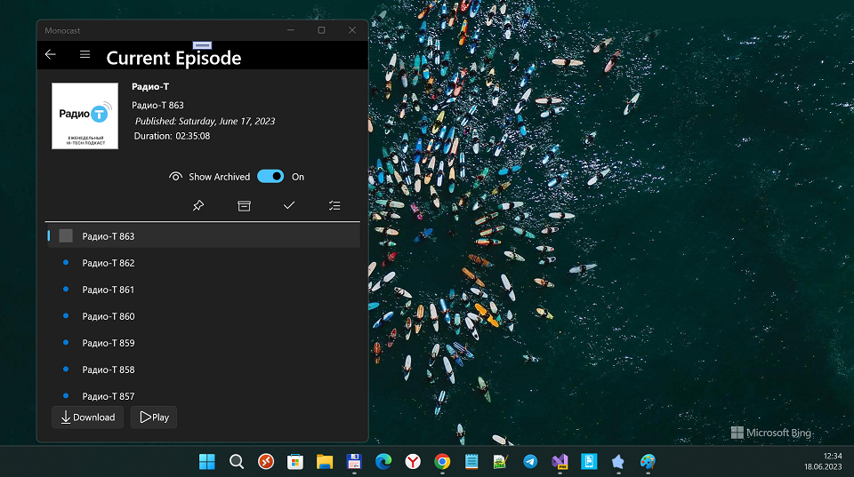
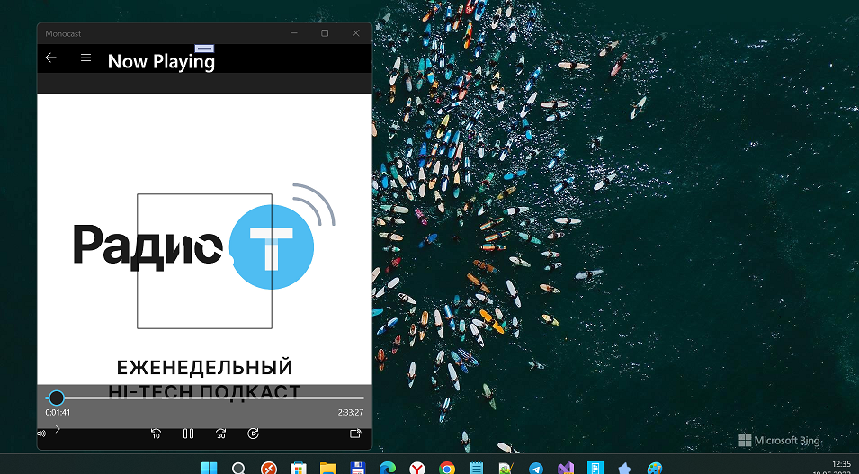

# Monocast 2.1.2-alpha
A UWP Podcast client for Windows 10 (Mobile?)

## About
The premier podcatcher :)

## Screenshots

## Tech. details
- Min. Win. OS Build = 15063
- MVVM
- MediaPlayer Background Task :)

## Bugs
- W10M has big problems. On my Lumia 950 (15242) i catched "empty black screen" after app end to start... :)

## TODO
- Go to my secont workstation. 
- Start (VS2017), attach real W10M device 
(L950, W10M build 16063) and debug Monocast UI 
(del AcrylicBrush, RadialProgressBar, etc.). 

## References
- https://github.com/adderthorn/Monocast Original Monocast app
- https://github.com/adderthorn Noah Wood, Monocast Creator / Developer 

## ..
As is. RnD only. DIY

## .
[m][e] 2023